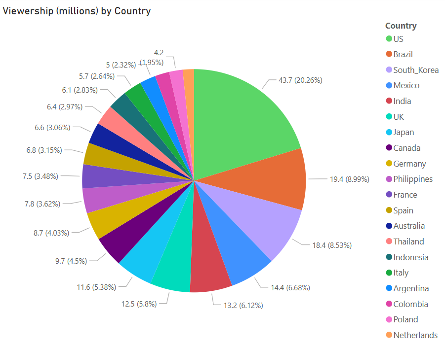

# Cleaning CSV Data with PowerBI Transforms - 'Gantry'

Simple end-to-end example of taking a dirty csv and turning it into a useful visual,
all using PowerBI.

## Data

I am using the csv from [this Kaggle dataset](https://www.kaggle.com/datasets/willianoliveiragibin/k-pop-warriors-dataset),
which contains sample viewership numbers for a movie by country.

This data is horrific.
 - Why are the first and second column an unpivoted list of attributes not related to viewership at all?
 - Why are the third and fourth column values formatted so weirdly?
 - Why does the third header contain a newline character?
 - Why is the fourth header straight up incorrect?
 - Why are there multiple rows of just zeroes?

The goal of this module is clean up this stinking pile of garbage.
Specifically, I'd like to put columns 3 and 4 into a pie chart.

## PowerBI

### Loading

I loaded the raw CSV with *Get Data* > *Text/CSV*,
leaving the parse settings (delimiter, etc) untouched.

Open the Query editor (*Transform Data* > *Transform Data*).
You'll find a source query created with two steps:

```
= Csv.Document(File.Contents("\path\to\csv\source.csv"),[Delimiter=",", Columns=4, Encoding=65001, QuoteStyle=QuoteStyle.Csv])
= Table.TransformColumnTypes(Source,{{"Column1", type text}, {"Column2", type text}, {"Column3", type text}, {"Column4", type text}})
```

`Csv.Document` and `Table.TransformColumnTypes` are both builtin functions of Power Query M.
They should be self-explanatory.

### Cleaning

I added a few more steps to the `source` query:

```
= Table.RenameColumns(#"Changed Type", {{"Column1", "Movie_Fields"}, {"Column2", "Movie_Values"}, {"Column3", "Country"}, {"Column4", "Viewership"}})
= Table.RemoveFirstN(#"Renamed Columns", 1)
= Table.RemoveLastN(#"Deleted Garbage Headers", 14)
```

Note that these are three separate steps with their own names and everything.
The `#" ... "` syntax is just used to identify steps whose names include spaces.

Normally the first two could be replaced with `Table.PromoteHeaders`
but the source headers are unsalvageably bad.

### Creating the Pie Chart

I created a "Viewership by Country" query with these steps

```
= source
= Table.RemoveColumns(Source,{"Movie_Fields", "Movie_Values"})
= Table.TransformColumns(
    #"Removed Columns",
    {{ "Country", each Text.AfterDelimiter(_, "_") }, { "Viewership", each Text.BetweenDelimiters(_, "(", "M") }}
)
= Table.TransformColumnTypes(#"Stripped Text Fluff", {{"Viewership", type number}})
```

`source` in the first step refers to the source query,
which is named `source` by default.
`Source` in the second step refers to the first step,
which is named `Source` by default.
Not sure if including a step just to specify the source query is idiomatic but whatever.

`each <Function>(_)` is the Power Query equivalent of a lambda function.
You can find some more examples in the docs for
[Table.TransformColumns](https://learn.microsoft.com/en-us/powerquery-m/table-transformcolumns)

After exiting the Query Editor,
I clicked the pie chart to make a pie chart.
Then I dragged `Viewership By Country > Country` (in the data panel) over `Legend` (in the visualization panel).
Same for `Viewership` and `Values`.
I then used *Rename for this visual* to specify that viewership is in millions.

Here is the result:



### Misc Reference

To open the Query editor:
 - *Transform Data* > *Transform Data*

To create a new query:
 - Locate the "Queries" pane (on the left).
 - Right click > *New Query* > *Blank Query*.

To add a step to a query:
 - Locate the "Query Settings" pane (on the right).
 - Locate the "Applied Steps" section (on the bottom).
 - Right click a step > *Insert Step After*.

To edit a step:
 - Type into the text box in the center.
 - There is a small dropdown button to expand the text box.
 - Click the check mark to compile and run the step.

Based on these steps everything else should be somewhat intuitive
(emphasis on the *somewhat*).
